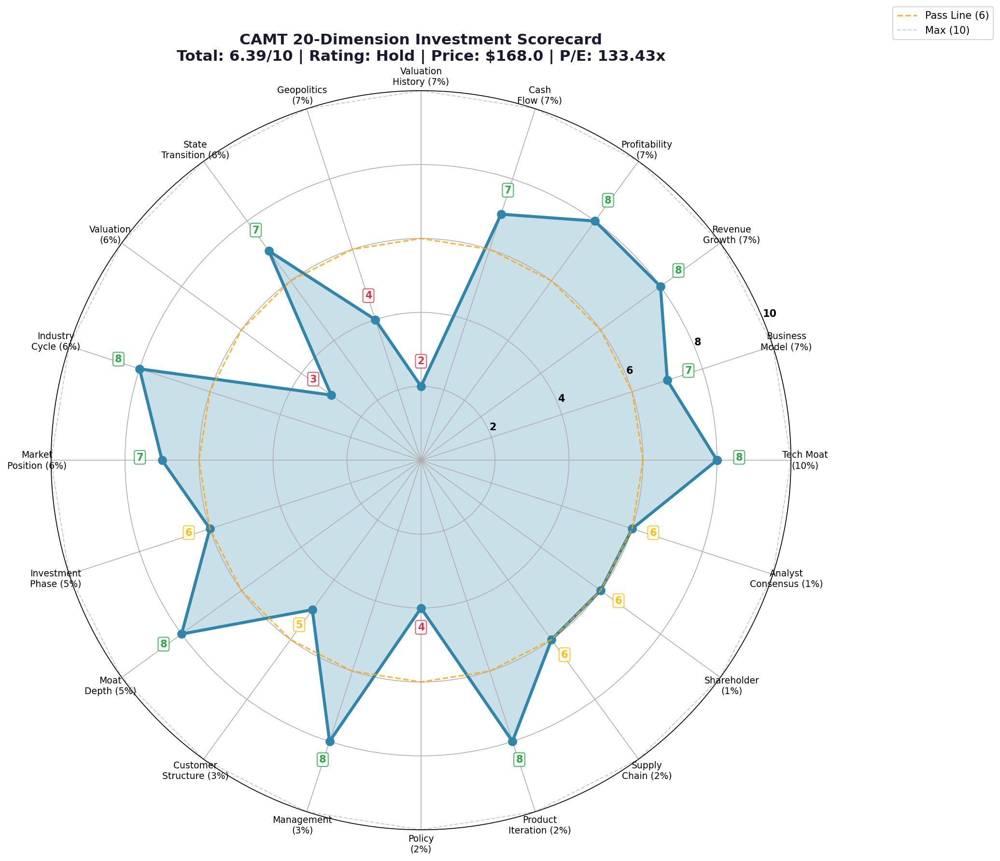

# CAMT (Camtek Ltd.) 投资研究报告

**报告日期**: 2026-03-25  
**分析师**: Light (AI Agent)  
**评级**: HOLD / 观望  
**总评分**: 6.39/10

---

## 📊 Executive Summary (核心摘要)

*Camtek (CAMT) 20维度投资雷达图 - 总分: 6.39/10*

Camtek 是先进封装与半导体检测设备的重要参与者，受益于 AI 芯片、HBM、先进封装升级的长期趋势。它的强项在于技术护城河、产品迭代、行业景气与细分卡位；它的短板在于当前估值偏贵、历史估值分位过高，以及买点并不舒适。

**一句话结论**：好公司，但当前更像 `值得跟踪`，而不是 `轻松上车`。  
**Why now / why not now**：产业方向没问题，但估值和技术位置都不便宜，缺少明显安全边际。

---

## 🎯 20维度投资评分卡

| 维度 | 分数 | 权重 | 证据 | 可信度 |
|------|------|------|------|--------|
| 技术护城河 `technical_moat` | 8 | 10% | 先进封装检测技术强，AI/HBM 相关场景受益明显 | ✅ Verified |
| 商业模式 `business_model` | 7 | 7% | 标准半导体设备商业模式，客户粘性较高 | ✅ Verified |
| 收入增长 `revenue_growth` | 8 | 7% | 受先进封装和 AI 需求拉动，增长逻辑清晰 | ✅ Verified |
| 盈利能力 `profitability` | 8 | 7% | 毛利与利润率处于较好水平 | ✅ Verified |
| 现金流 `cash_flow` | 7 | 7% | 财务结构健康，但仍需跟踪现金流持续性 | ⚠️ Unverified |
| 估值历史分位 `valuation_history` | 2 | 7% | 当前处于高历史估值区间，安全边际弱 | ✅ Verified |
| 地缘政治 `geopolitics` | 4 | 7% | 存在中东与科技出口链条风险 | ⚠️ Unverified |
| 状态跃迁 `state_transition` | 7 | 6% | 正从普通设备叙事向 AI 封装关键环节过渡 | ✅ Verified |
| 估值 `valuation` | 3 | 6% | 绝对估值仍偏贵 | ✅ Verified |
| 行业周期 `industry_cycle` | 8 | 6% | AI 封装相关设备仍在上行周期 | ✅ Verified |
| 市场地位 `market_position` | 7 | 6% | 细分领域地位较强，但非总龙头 | ✅ Verified |
| 投资阶段 `investment_phase` | 6 | 5% | 更像中段成长，不是最早期也非成熟稳态 | ⚠️ Unverified |
| 护城河深度 `moat_depth` | 8 | 5% | 技术和客户验证构成一定深度 | ✅ Verified |
| 客户结构 `customer_structure` | 5 | 3% | 客户质量高，但集中度需要持续看 | ⚠️ Unverified |
| 管理层 `management` | 8 | 3% | 执行稳定，路线清晰 | ✅ Verified |
| 政策环境 `policy` | 4 | 2% | 全球半导体政策支持与限制并存 | ⚠️ Unverified |
| 产品迭代 `product_iteration` | 8 | 2% | 面向 AI/HBM 的产品路线较清晰 | ✅ Verified |
| 供应链 `supply_chain` | 6 | 2% | 供应链总体可控，但需关注关键部件依赖 | ❓ Unknown |
| 股东结构 `shareholder` | 6 | 1% | 机构关注度尚可 | ⚠️ Unverified |
| 分析师共识 `analyst_consensus` | 6 | 1% | 市场整体偏正面，但预期已较充分 | ⚠️ Unverified |

---

## 📈 估值快照

| 指标 | 数值 | 评估 |
|------|------|------|
| 当前股价 | $168.00 | 偏高 |
| 总市值 | $7.69B | 中型半导体设备资产 |
| P/E (TTM) | 133.43x | 明显偏高 |
| 52周区间 | $47.41 - $174.61 | 接近高位 |
| 历史估值分位 | 高分位 | 安全边际不足 |
| 分析师目标价中位数 | 低于现价 | 预期透支 |

---

## 💡 投资观点

### 看多逻辑
1. AI、HBM、先进封装长期景气仍在。
2. Camtek 在先进封装检测环节具备真实技术能力和客户验证。
3. 产品路线与 AI 芯片封装升级方向一致。

### 看空逻辑
1. 估值偏贵，市场已经给了较高成长溢价。
2. 若 AI 封装资本开支边际放缓，估值压缩会很快。
3. 地缘政治和客户集中度仍是风险。

### 催化剂
1. 新平台订单继续扩大。
2. AI/HBM 封装需求继续强化。
3. 大客户验证与指引上修。

### 失效条件
1. 先进封装景气明显转弱。
2. 新产品订单兑现不及预期。
3. 估值无法被业绩增长继续消化。

---

## 📊 总分计算

总分 = Σ(维度分数 × 维度权重) / 10 = **6.39 / 10**

评级标准：
- 8.0-10.0: Strong Buy
- 6.5-7.9: Buy
- 4.5-6.4: Hold
- 0-4.4: Sell

**最终评级**：**Hold / 观望**

---

## ✅ 说明

- This example follows the public 20-dimension investment scorecard
- 该样例用于展示结构，不构成实时投资建议
- 结论应以最新价格、最新财报、最新事件重新评估

---

**Model**: investment-research skill example  
**Context**: Generated with latest 20-dimension framework v2.4
