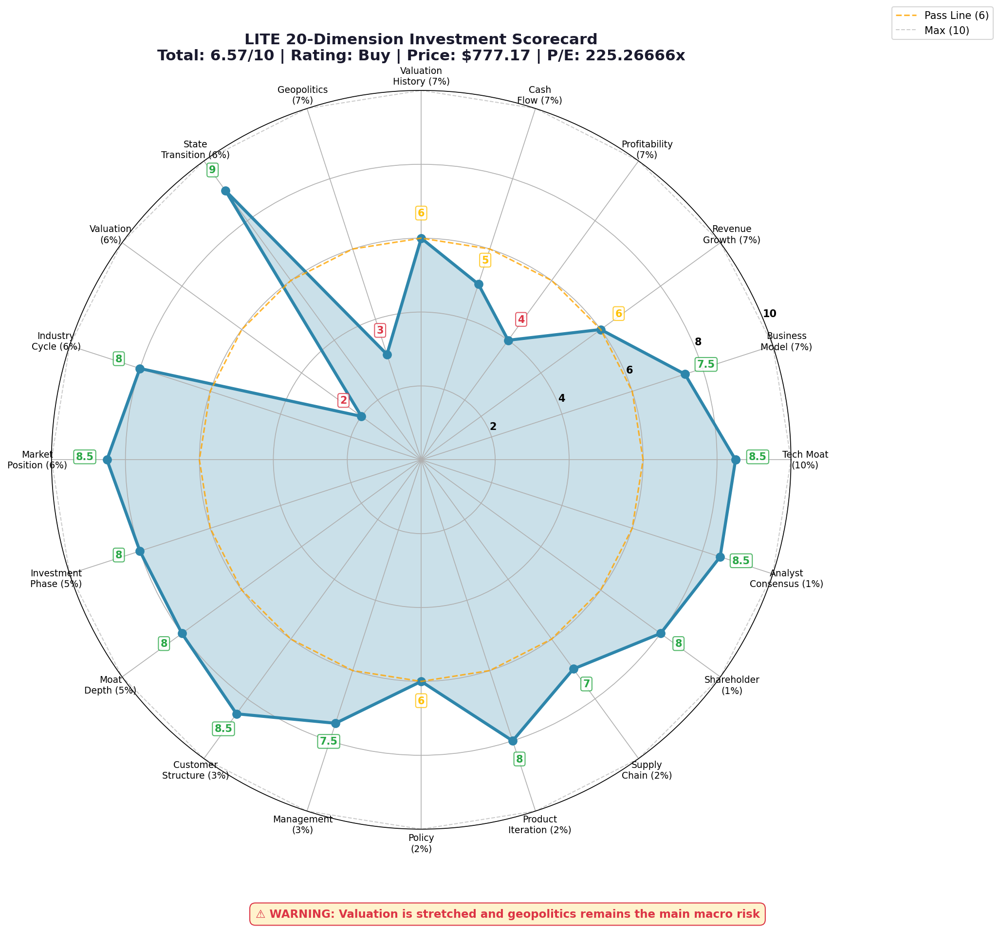

# LITE Investment Research

## Executive Summary
- Final rating: `Buy`
- Total score: `6.57 / 10`
- Core essence: Lumentum 已从传统光通信/消费电子链供应商，跃迁为 AI 算力基础设施中的核心光互联参与者。
- Why now / why not now: 基本面方向仍对，但短期不是“便宜买点”——更像高质量趋势资产，而不是低风险抄底资产。

## 20-Dimension Scorecard
| Dimension | Score | Weight | Evidence | Confidence |
|-----------|------:|-------:|----------|------------|
| technical_moat | 8.5 | 10% | 在光通信与激光芯片领域有深厚技术积累，是高性能光模块关键供应商 | ✅ Verified |
| business_model | 7.5 | 7% | 已从消费电子暴露转向 AI 数据中心光互联，商业质量上升 | ✅ Verified |
| revenue_growth | 6.0 | 7% | 增长方向明确，但高基数下持续加速仍待后续验证 | ⚠️ Unverified |
| profitability | 4.0 | 7% | 盈利仍偏弱，当前高估值对利润兑现要求很高 | ⚠️ Unverified |
| cash_flow | 5.0 | 7% | 中性，缺少更完整一手现金流细节支撑更高评分 | ❓ Unknown |
| valuation_history | 6.0 | 7% | 经历大幅重估后，已不在舒服区间 | ⚠️ Unverified |
| geopolitics | 3.0 | 7% | 跨境供应链与地缘风险明显压分 | ✅ Verified |
| state_transition | 9.0 | 6% | 已成功跃迁为 AI 光互联核心基建标的 | ✅ Verified |
| valuation | 2.0 | 6% | 估值很贵，短期容错率低 | ✅ Verified |
| industry_cycle | 8.0 | 6% | AI 数据中心光互连景气度仍高 | ✅ Verified |
| market_position | 8.5 | 6% | 与头部 AI 生态客户绑定紧密，战略地位高 | ✅ Verified |
| investment_phase | 8.0 | 5% | 处于产能扩张与业绩兑现的第二阶段 | ✅ Verified |
| moat_depth | 8.0 | 5% | 制造工艺与专利组合形成稳固壁垒 | ✅ Verified |
| customer_structure | 8.5 | 3% | 客户质量极高，但仍需留意核心客户依赖 | ✅ Verified |
| management | 7.5 | 3% | 管理层转型执行力较强 | ✅ Verified |
| policy | 6.0 | 2% | AI 基建和数据中心资本开支环境整体顺风 | ⚠️ Unverified |
| product_iteration | 8.0 | 2% | 产品节奏与高速率光模块需求高度同步 | ✅ Verified |
| supply_chain | 7.0 | 2% | 制造能力较强，但扩产与原料链仍有挑战 | ✅ Verified |
| shareholder | 8.0 | 1% | 纳入标普 500 后机构化程度提升 | ✅ Verified |
| analyst_consensus | 8.5 | 1% | 市场对其 AI 光互联长期空间高度乐观 | ✅ Verified |

## Valuation
- Current price: `777.17`
- Market cap: `❓ Unknown`（本次样本未取到稳定一手值）
- Core multiple(s): `P/E ≈ 225.3x`
- Historical valuation position: 大幅上涨后已处在高预期区间。
- Peer comparison: 相比 `AAOI`，LITE 的质量与确定性更强；相比 `COHR`，LITE 的市场叙事更顺、更纯粹，但估值也更贵。

## Thesis
### Bull Case
- 已成为 AI 算力基础设施里高价值的光互联核心受益者。
- 技术壁垒、客户绑定与行业位置都处于强势档位。
- 数据中心升级与 AI 集群扩张继续支撑中期需求。

### Bear Case
- 估值极高，一旦增速或利润兑现不及预期，回撤会很快。
- 地缘政治与供应链约束会压制估值中枢。
- 高度乐观的一致预期意味着“超预期难度”更高。

### Key Risks
- 高估值压缩。
- 利润兑现不及预期。
- AI 资本开支节奏低于预期。
- 地缘与供应链扰动。

### Catalysts
- 新一轮 AI 数据中心扩产确认。
- 高速率光模块持续放量。
- 财报继续验证收入与订单质量。
- 头部客户设计赢单或追加订单。

## Final Judgment
- Rating: `Buy`
- Why now / why not now: 它仍然值得持有甚至逢回调布局，但不属于“闭眼追高”型买点。
- What would upgrade the name: 利润率持续抬升、现金流显著改善、估值回落后仍维持高增长。
- What would downgrade the name: 订单增速放缓、盈利兑现失败、AI capex 节奏低于预期、地缘风险放大。

## Data Notes
- Main source base comes from local `invest-autoresearch` outputs dated `2026-03-26`.
- Recent news flow includes strong momentum framing, S&P 500 inclusion discussion, and continued AI-partner narrative.
